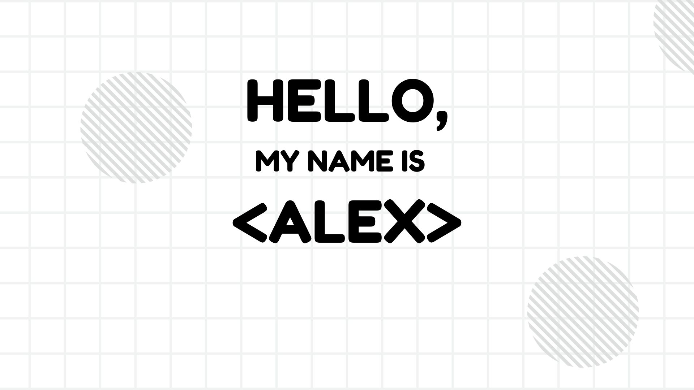

&nbsp;

## About me

I'm a 21-year-old CS student from Ukraine, currently in my 4th year.

- 👨🏽‍💻 I’m currently working on [Heart Attack Prediction](https://github.com/IWillCall/Heart-attack-prediction) project.

- ❤︎ I love: 🔬science, 📝 math, and staying active with sports 🏃🏻.

- 🔍These days, I'm diving deep into machine learning 🤖 and computer vision 👁, constantly exploring and growing in the field.

- ⚡️Fun fact: I’m a proud member of the “lemon adept” club 🍋

## My skills

